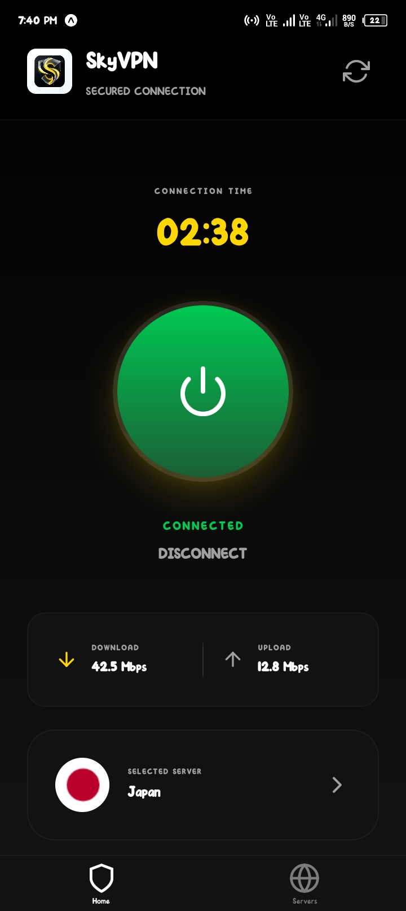
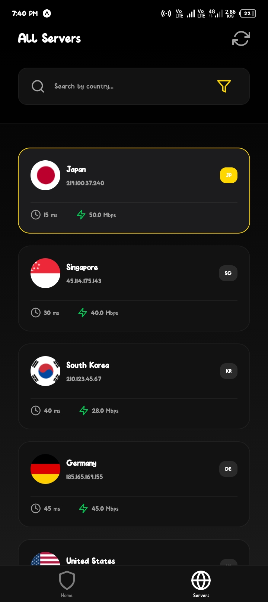

# SkyVPN Pro 🚀

A high-performance, premium VPN client built with Expo and focused on a luxe "Bumblebee" aesthetic (Gold & Black).

## 🌟 Features
- **Instant Connection**: Optimized server discovery using VPN Gate API mirrors.
- **Luxe UI**: High-contrast dark mode design with premium gold accents.
- **Global Server Network**: Access to servers in Japan, USA, Germany, Singapore, Australia, and more.
- **Safe Area Optimized**: Perfect layout on all modern notched devices.
- **Pro Metrics**: Real-time connection timer and data transfer (Up/Down) stats.
- **Security Features**: Integrated Kill Switch and Smart Connect toggles.
- **Automation Ready**: Prepared with Codemagic workflows for automated Debug and Release APK builds.

## 📸 Screenshots

  
  

## 🛠️ Technology Stack
- **Framework**: Expo (React Native)
- **Styling**: Vanilla CSS / React Native Stylesheets
- **Animations**: React Native Reanimated
- **Icons**: FlagCDN & Feather Icons
- **CI/CD**: Codemagic & EAS Build

## 🚀 How to Run
1. Clone the repo: `git clone https://github.com/dinesh-mahi-dev/skyvpn.git`
2. Install dependencies: `npm install`
3. Start the project: `npx expo start`

## 🏗️ Build Profiles
Generated via EAS Build:
- **Debug**: `npx eas build --profile development --platform android`
- **Release (APK)**: `npx eas build --profile preview --platform android`

---
*Created with ❤️ by Dinesh Mahi*
